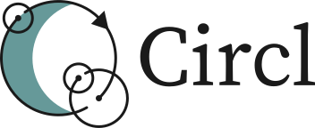

WARNING: WIP

Arrays are stupid. What if you could address them circularly? (also a "true" von-neuman architecture language)

A half silly, half serious code golfing language. Produced by 70% human tears, and 30% googling "how do i do x in python" and copy pasting the best result (huge thanks to the members of the Gregtech New Horizons discord server, specifically Offtopic2! You guys are the goats!)

Inspired by Uiua, Jelly, APL, Vyxal, https://en.wikipedia.org/wiki/List_of_Unicode_characters, the general concept of "magic circles", TIS-100, Hexcasting (for Minecraft) and Trickster (for Minecraft).
